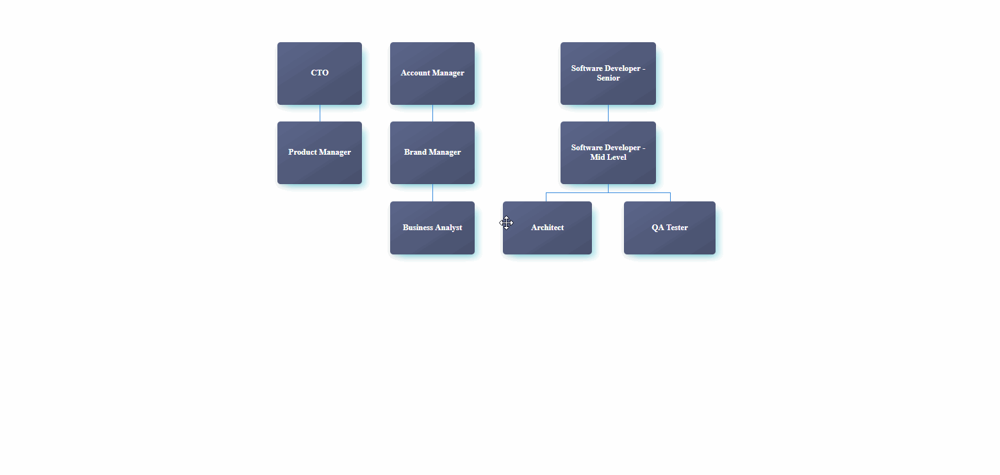

# Drag and Drop for Google Organisation Chart

## Introduction
This is companion code for my blog post found [here](http://craig-bruce.com/augmenting-google-org-chart-with-drag-and-drop/). Therein lies more details.

## Why?
Because, although Google Charts are great, there aren't enough features. Let's change that.

## How?
Simply:

```
  yarn && yarn start
```
Or:
```
  npm i && npm run start
```

You will then be able to play with the component on http://localhost:8080

Happy dragging and dropping :)

